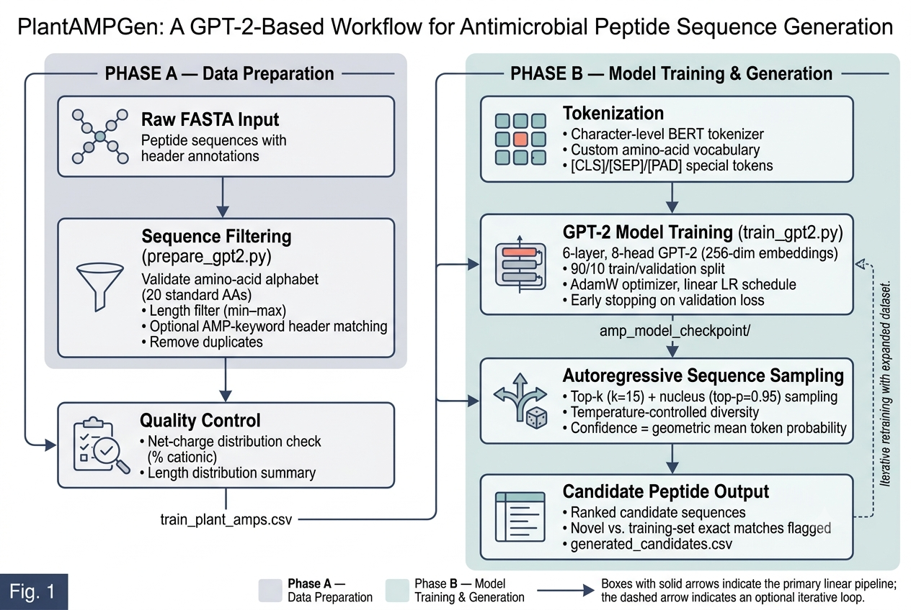

# PlantAMPGen: Antimicrobial Peptide Sequence Generator


A lightweight GPT-2-style autoregressive language model for generating novel
antimicrobial peptide (AMP) candidate sequences, trained on curated peptide
data from FASTA sources. The pipeline has two stages: (1) filtering and
tokenizing raw FASTA sequences into a training-ready CSV, and (2) training a
small GPT-2 model on those sequences and sampling new candidates.

<p align="center">
  
</p>

<p align="center"><em>Figure: End-to-end PlantAMPGen workflow — from raw FASTA input through data preparation, GPT-2 training, and novel AMP candidate generation.</em></p>

---

## Pipeline Overview

```
raw_sequences.fasta
        │
        ▼
  prepare_gpt2.py   ──►  train_plant_amps.csv   (filtered, deduplicated sequences)
        │
        ▼
   train_gpt2.py    ──►  amp_model_checkpoint/  (HF checkpoint + generated_candidates.csv)
                    ──►  amp_gpt2_model.pkl     (pickled config + state_dict)
```

1. **`prepare_gpt2.py`** parses a FASTA file, filters sequences by length and
   amino-acid validity, optionally filters by AMP-related keywords in the
   header, deduplicates, and writes a training file (tokenized or CSV
   format).
2. **`train_gpt2.py`** tokenizes the sequences with a character-level BERT
   tokenizer, trains a small GPT-2 model from scratch with a train/val split
   and early stopping, then generates novel candidate peptides with
   top-k/top-p sampling.

---

## Requirements

- Python 3.9+
- [PyTorch](https://pytorch.org/) (CUDA optional but recommended)
- [Transformers](https://github.com/huggingface/transformers) (`BertTokenizer`, `GPT2Config`, `GPT2LMHeadModel`, `get_scheduler`)
- [Biopython](https://biopython.org/) (`Bio.SeqIO`, used only in `prepare_gpt2.py`)
- NumPy

Install dependencies:

```bash
pip install torch transformers biopython numpy
```

Clone the repository:

```bash
git clone https://github.com/skbinfo/PlantAMPGen.git
cd PlantAMPGen
```

---

## Repository Contents

```
PlantAMPGen/
├── LICENSE
├── PlantAMPGen_Workflow.png     # Workflow diagram (shown above)
├── README.md
├── prepare_gpt2.py              # Step 1: FASTA filtering & preparation
├── train_gpt2.py                # Step 2: GPT-2 training & generation
├── vocab.txt                    # Amino-acid tokenizer vocabulary
├── amp_gpt2_model.pkl           # Pickled {config, state_dict} of best checkpoint
└── amp_model_checkpoint/        # Hugging Face checkpoint (created after training)
    ├── config.json
    ├── generation_config.json
    ├── model.safetensors
    ├── special_tokens_map.json
    ├── tokenizer_config.json
    ├── vocab.txt
    └── generated_candidates.csv # Ranked novel AMP candidates
```

| File | Purpose |
|---|---|
| `prepare_gpt2.py` | Converts a raw FASTA file into a filtered, model-ready sequence file. |
| `train_gpt2.py` | Trains the GPT-2 model on the prepared sequences and generates candidate peptides. |
| `vocab.txt` | Character-level vocabulary file for the tokenizer (must be provided; see below). |

### `vocab.txt`

`train_gpt2.py` loads a `BertTokenizer` from a plain-text vocabulary file
(one token per line). This should be a minimal amino-acid vocabulary
containing the 20 standard single-letter amino acid codes plus the special
tokens `[CLS]`, `[SEP]`, `[PAD]`, and `[UNK]` (lowercase, since the tokenizer
is loaded with `do_lower_case=True`). `[CLS]` is used as the beginning-of-
sequence token and `[SEP]` as the end-of-sequence token.

---

## Step 1: Prepare Training Data — `prepare_gpt2.py`

Filters and converts a FASTA file of peptide sequences into a clean training
file, printing a summary of how many sequences were dropped and why, plus a
sanity check on the net charge distribution of the kept sequences (AMPs are
typically net cationic).

### Usage

```bash
python prepare_gpt2.py \
  --fasta_file new_deduplicated.fasta \
  --output_csv train_plant_amps.csv \
  --min_len 5 \
  --max_len 32 \
  --format tokens
```

### Arguments

| Argument | Default | Description |
|---|---|---|
| `--fasta_file` | `new_deduplicated.fasta` | Input FASTA file. Also supports a non-standard fallback format of alternating header/sequence lines without `>` prefixes. |
| `--output_csv` | `train_plant_amps.csv` | Path to the output training file. |
| `--min_len` | `5` | Minimum peptide length (inclusive) to keep. |
| `--max_len` | `32` | Maximum peptide length (inclusive) to keep. |
| `--require_amp_keyword` | off | If set, only keep records whose FASTA header/description matches one of the AMP-related keywords (e.g. `antimicrobial`, `defensin`, `cecropin`, `magainin`, `bacteriocin`, `cathelicidin`, `thionin`, etc.). |
| `--keywords` | `None` | Custom list of keywords to use instead of the built-in default list, when `--require_amp_keyword` is set. |
| `--format` | `tokens` | Output format: `tokens` writes one space-separated amino-acid sequence per line (matches `train_gpt2.py`'s expected input); `csv` writes a two-column `id,sequence` CSV instead. |

### Filtering steps

1. Drop sequences containing any character outside the 20 standard amino
   acids (`ACDEFGHIKLMNPQRSTVWY`).
2. Drop sequences outside the `[min_len, max_len]` length range.
3. (Optional) Drop sequences whose header doesn't match an AMP keyword.
4. Drop exact-duplicate sequences (first occurrence is kept).

### Output

- The filtered/tokenized sequence file at `--output_csv`.
- A console summary of total records, records dropped at each filtering
  step, and the number kept.
- Length statistics (min/max/mean) and an approximate net-charge-at-pH-7
  sanity check across the kept sequences.

> **Note:** `train_gpt2.py` reads its input with `csv.reader` and takes
> `row[0]` per line, so both the `tokens` and `csv` output formats are
> readable by the training script, but `tokens` (the default) is the
> intended format — it feeds one plain sequence per line directly to the
> tokenizer's `.encode()` call.

---

## Step 2: Train the Model — `train_gpt2.py`

Trains a small GPT-2 language model from scratch on the prepared sequences
and then samples novel candidate peptides.

### Usage

```bash
python train_gpt2.py \
  --data_path train_plant_amps.csv \
  --vocab_path vocab.txt \
  --output_dir ./amp_model_checkpoint \
  --pkl_output_path ./amp_gpt2_model.pkl \
  --epochs 50 \
  --batch_size 64 \
  --lr 3e-4
```

### Arguments

| Argument | Default | Description |
|---|---|---|
| `--data_path` | `./train_plant_amps.csv` | Sequence file produced by `prepare_gpt2.py`. |
| `--vocab_path` | `./vocab.txt` | Path to the tokenizer vocabulary file. |
| `--output_dir` | `./amp_model_checkpoint` | Directory where the best HF checkpoint, tokenizer files, and generated candidates CSV are saved. |
| `--pkl_output_path` | `./amp_gpt2_model.pkl` | Path for a pickled dict containing the model `config` and `state_dict` of the best checkpoint. |
| `--epochs` | `50` | Maximum number of training epochs. |
| `--batch_size` | `64` | Batch size for both train and validation loaders. |
| `--lr` | `3e-4` | AdamW learning rate. |
| `--weight_decay` | `0.01` | AdamW weight decay. |
| `--val_split` | `0.1` | Fraction of sequences held out for validation. |
| `--patience` | `5` | Early-stopping patience, in epochs without validation-loss improvement. |
| `--seed` | `42` | Random seed for Python, NumPy, and PyTorch (including CUDA). |

### What happens during training

1. Sequences are loaded, uppercased, deduplicated, and tokenized.
2. Data is split into train/validation sets (`--val_split`), with at least
   one sequence guaranteed in validation.
3. A `GPT2Config`/`GPT2LMHeadModel` is built from scratch with:
   - `n_positions` / `n_ctx = 50`
   - `n_embd = 256`
   - `n_layer = 6`
   - `n_head = 8`
   - Dropout (`resid_pdrop`, `embd_pdrop`, `attn_pdrop`) = `0.15`
   - `bos_token_id` = `[CLS]`, `eos_token_id` = `[SEP]`, `pad_token_id` = `[PAD]`
4. The model is trained with AdamW + a linear LR schedule (100 warmup
   steps), gradient clipping at norm 1.0, and per-token cross-entropy loss
   (padding excluded).
5. After each epoch, validation loss/accuracy are computed. Whenever
   validation loss improves, the checkpoint is saved (both as an HF
   `save_pretrained` directory and as a pickle of `{config, state_dict}`).
   Training stops early if validation loss hasn't improved for
   `--patience` epochs.
6. The best checkpoint is reloaded and used to generate 1,000 novel
   candidate sequences (see below), written to
   `<output_dir>/generated_candidates.csv`.

> If the input dataset has fewer than 50 sequences, the script prints a
> warning that a model of this size is likely to memorize rather than
> generalize, and that generated candidates should be interpreted with
> that in mind.

### Sequence generation

`generate_sequences()` autoregressively samples peptides starting from the
`[CLS]` token using:

- **Temperature scaling**
- **Top-k filtering** (default `k=15`, dynamically clamped to the
  vocabulary size)
- **Nucleus / top-p filtering** (default `p=0.95`)
- A minimum generated length (`min_len=5`) and maximum length
  (`max_length=50`)
- Rejection of sequences containing non-standard amino acids or duplicates
  within the same generation run

Generation stops for a given sequence when the `[SEP]` token is sampled or
`max_length` is reached. Each result is scored with a **confidence** value —
the geometric mean of per-token sampling probabilities
(`exp(mean(log p))`, equivalent to `1 / perplexity`), bounded in `(0, 1]` —
and flagged as an exact match to the training set or a novel sequence.
Results are sorted by descending confidence.

### Outputs

| File | Description |
|---|---|
| `<output_dir>/` | Hugging Face model + tokenizer checkpoint (best validation loss). |
| `<output_dir>/generated_candidates.csv` | Columns: `Sequence`, `Confidence`, `ExactMatchToTraining` for all sampled candidates. |
| `<pkl_output_path>` | Pickled `{"config": GPT2Config, "state_dict": ...}` of the best checkpoint. |

Console output also reports, for the final generation run, how many
candidates exactly matched a training sequence versus how many were novel.

---

## End-to-End Example

```bash
# 1. Filter and tokenize raw FASTA data
python prepare_gpt2.py \
  --fasta_file raw_amps.fasta \
  --output_csv train_plant_amps.csv \
  --require_amp_keyword

# 2. Train the model and generate candidates
python train_gpt2.py \
  --data_path train_plant_amps.csv \
  --vocab_path vocab.txt \
  --output_dir ./amp_model_checkpoint \
  --epochs 50
```

---

## Notes & Caveats

- This is a **research/screening tool**, not a validated design pipeline.
  Any generated candidate should be evaluated computationally (e.g.
  physicochemical property checks, similarity/novelty analysis, structure
  prediction) and, where relevant, experimentally validated before drawing
  conclusions about antimicrobial activity or safety.
- Training on small datasets (a few dozen to a few hundred sequences) makes
  the model prone to memorizing the training set rather than learning
  generalizable sequence patterns — check the `ExactMatchToTraining` column
  and treat a high exact-match rate as a signal of memorization, not
  novelty.
- The `top_k` default (15) is tuned for a small amino-acid vocabulary; adjust
  `top_k`/`top_p`/`temperature` in `generate_sequences()` if you change the
  vocabulary or want more/less diverse output.

---

## License

This project is licensed under the terms of the [`LICENSE`](./LICENSE) file
included in this repository.

---


## Repository

[github.com/skbinfo/PlantAMPGen](https://github.com/skbinfo/PlantAMPGen)

---

# Developers

### Love Kaushik

📧 lovekaushik271@gmail.com

🔗 LinkedIn: https://www.linkedin.com/in/love-kaushik-083955209/

---

### Md. Faiyaz Rizwee

📧 mdfaiyaz4840@gmail.com

🔗 LinkedIn: https://www.linkedin.com/in/md-faiyaz-rizwee-62024438b

---

### A.T. Vivek

📧 vivek37373@nipgr.ac.in

🔗 LinkedIn: https://www.linkedin.com/in/vivek-thiruvettai/

---

# Contact

For questions, bug reports, feature requests, or scientific discussions, please contact:

**Dr. Shailesh Kumar**

Staff Scientist  
Bioinformatics Laboratory #202  
National Institute of Plant Genome Research (NIPGR)  
New Delhi, India

📧 **Email:** shailesh@nipgr.ac.in
